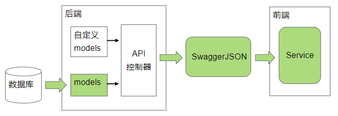

# Interface Research

研究Restful API前后端联调的新模式: 以协议为中心, 详见文档

基于前后端分离的web项目, 一个数据定义被重写了至少3遍: 数据库DDL, 后端接口数据模型, 前端(web, 小程序, Android, IOS等); 首先是工作重复, 其次是系统难以维护和数据结构不安全

#### 为什么要研究
* 工作更轻松: 前后端数据结构能完全自动统一, 前后端减少联调工作量
* 系统更安全: 数据结构更加规范

## 研究进度
后端:
* java ssm: 90%
* nodejs: ?
* goland: ?
* python: ?
* php: ?

前端:
* typescript: 90%
* javascript: ?
* 微信小程序: ?
* android: ?
* IOS: ?

## 实施步骤
