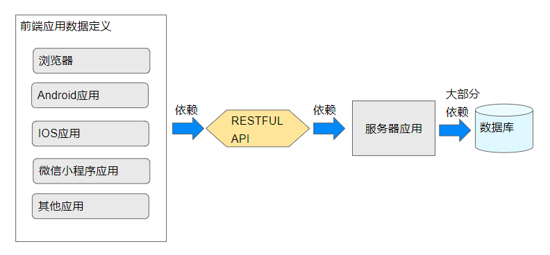
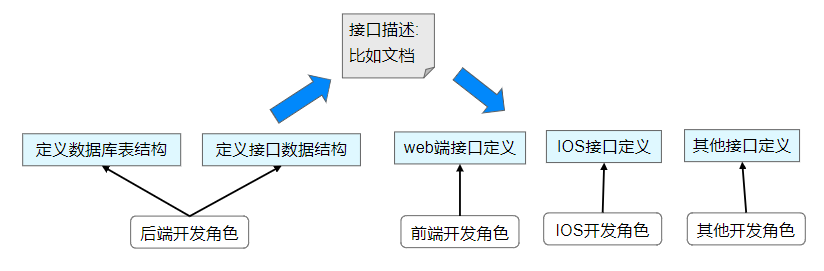
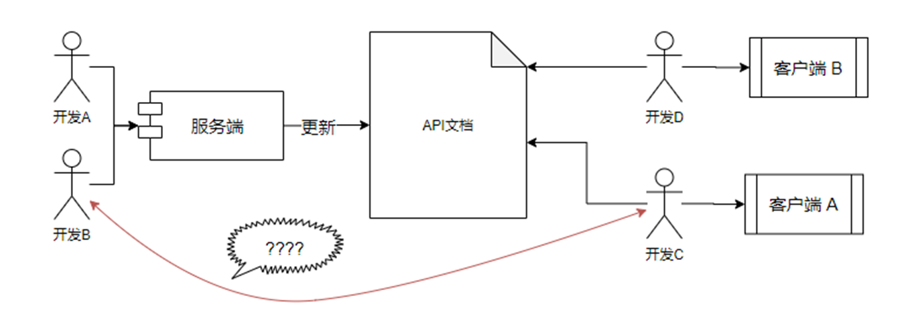
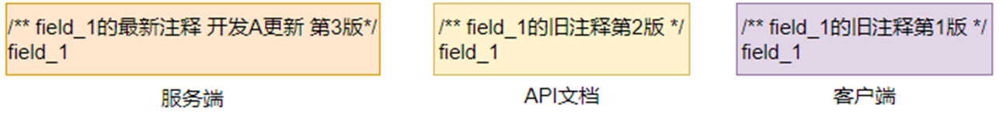
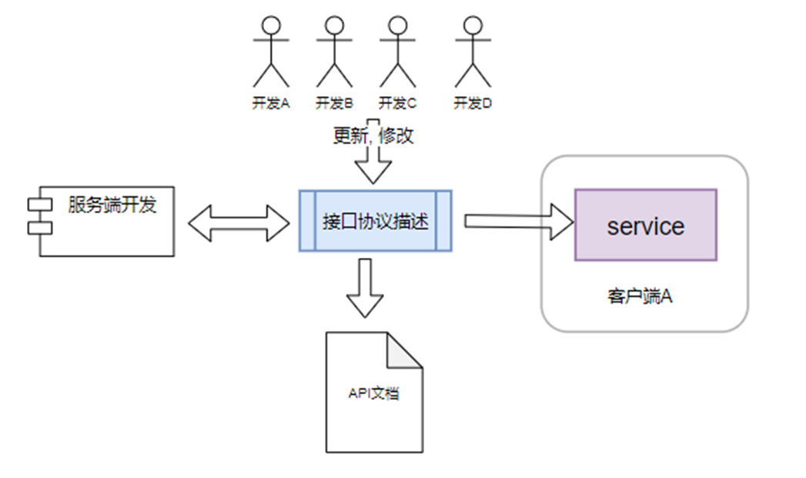
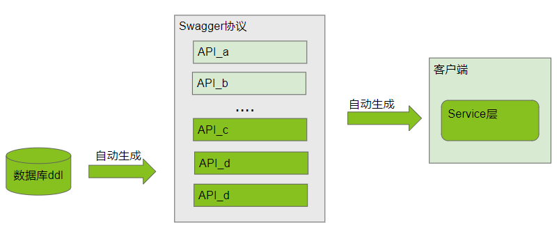
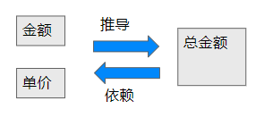

# Introduction

## 引言

软件开发的业务开发依赖于数据, 而数据需要定义, 谁定义, 在哪定义, 怎么定义, 这些行为与过程影响着软件迭代的进度, 软件的质量, 特别对于大型复杂的软件系统, 需要不定迭代, 进化和重构.
对于当下的网络应用, 一般是前后端分离的开发形式, 后端提供RESTFUL接口, 前端可以是浏览器, Android应用, IOS应用, 微信小程序应用等等, 下图是数据定义端与端的关系:

数据的定义, 形式上会出现在各个程序上, 比如前端, 服务端, 数据库等, 但是这些定义是高度一致的,
这些定义的工作由不同的角色完成:后端开发设计数据库表和实现RESTFUL接口数据定义, web端开发更具API文档书写接口调用, IOS端也是如此;

## 痛点
> 传统前端后端联调模式问题: **不可靠**, **重复工作量**, **低效**

* 整个过程写了两份协议, 服务端一份, 客户端一份, **工作重复**
* 联调周期很长, 并且需要不断的重复沟通, B发布了一项接口参数更新, 需要通知C去查看文档, 那么C有这么一个待办事项, 什么时候执行大多数时候不得而知, 过了一段时间C查看了文档之后发现有几个地方不合理, 那么又通知B, 这样联调的周期又延时又低效
* 令人忽视的一点是注释, 同一个接口描述, 同一个参数的描述可能存在3中描述, 这可能让团队每个人对业务的理解都不一样

  
## 解决方案
> 以API协议为中心

* 前后端维护唯一一个的规范来描述接口定义
* 不同的客户端语言可以根据这个协议生成可执行的接口和数据定义
* todo:服务端

## 研究的预期目标与意义
自动化同步数据结构定义
> 后端能根据数据库ddl自动化生成部分Swagger
> 前端(web, IOS, Android, 微信小程序等)能100%生成Service层可执行代码

   
## 本文的工作内容与目的
基于OpenAPI(Swagger)协议为中心, 研究如何生成Swagger, 如何使用Swagger生成不同客户端的可执行代码
范围:
* 数据库基于MySQL
* 后端语言包括常用的Java, PHP, Go, Python等
* 客户端包括常用的Javascript, Typescript, Java(Android), Object-C(IOS), 微信小程序, Taro

## 目标成果
1. 研究结果文档:本文
2. 相关程序工具
3. 解决方案的具体工程化详细步骤

## 100%完备性
一个订单的总金额 = 商品单价 * 数量
总金额是100%依赖商品单价与数量这两个值

## 如何参与贡献
任何人都可以参与, 成果开源

[comment]: <> (不限于以下工作:)

[comment]: <> (* 补充说明完善文档)

[comment]: <> (* 研究后端的某个语言如何生成Swagger)

[comment]: <> (* 研究前端的某个技术栈如何生成Service代码)

## 资料
流程图在线地址:
https://docs.qq.com/slide/DUW1JVlN1RkVsRXNM
